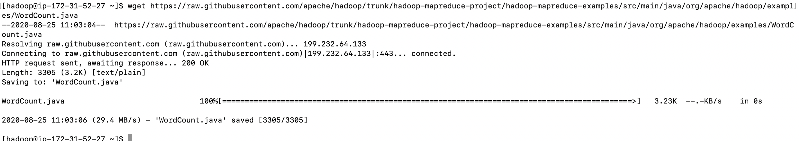

# MapReduce Lab

1. Login to EMR Master Node

2. Download the Word Count.java
  ```
  wget https://raw.githubusercontent.com/apache/hadoop/trunk/hadoop-mapreduce-project/hadoop-mapreduce-examples/src/main/java/org/apache/hadoop/examples/WordCount.java
  ```
  

3. Create a directory

  ```
  mkdir -p build
  ```

4. Compile the wordcount program
  ```
  javac -cp /usr/lib/hadoop/*:/usr/lib/hadoop-mapreduce/* WordCount.java -d build -Xlint
  ```
  

5. Create the wordcount jar file
  ```
  jar -cvf wordcount.jar -C build/ .
  ```

6. Download the input file into local machine
  ```
  aws s3 cp s3://amazon-reviews-pds/tsv/amazon_reviews_us_Digital_Music_Purchase_v1_00.tsv.gz .
  ```

7. Gunzip the file
  ```
  gunzip amazon_reviews_us_Digital_Music_Purchase_v1_00.tsv.gz
  ```

8. Put the file into HDFS
  ```
  hdfs dfs -put amazon_reviews_us_Digital_Music_Purchase_v1_00.tsv /user/hadoop
  
  hdfs dfs -ls /user/hadoop/amazon_reviews_us_Digital_Music_Purchase_v1_00.tsv  
  ```
  
      

9. Run the Hadoop wordcount program
  ```
  hadoop jar wordcount.jar org.apache.hadoop.examples.WordCount /user/hadoop/amazon_reviews_us_Digital_Music_Purchase_v1_00.tsv /user/hadoop/output
  ```
  

10. Checking YARN logs
  * Application logs
  ```
  [hadoop@ip-10-0-3-125 ~]$ yarn application --list -appStates FINISHED 
  20/08/25 18:45:27 INFO client.RMProxy: Connecting to ResourceManager at ip-10-0-3-125.eu-west-1.compute.internal/10.0.3.125:8032
  Total number of applications (application-types: [] and states: [FINISHED]):1
                Application-Id	    Application-Name	    Application-Type	      User	     Queue	             State	       Final-State	       Progress	                       Tracking-URL
  application_1598380160354_0002	          word count	           MAPREDUCE	    hadoop	   default	          FINISHED	         SUCCEEDED	           100%	http://ip-10-0-3-125.eu-west-1.compute.internal:19888/jobhistory/job/job_1598380160354_0002

  ```
  
  ```
  [hadoop@ip-10-0-3-125 ~]$ yarn logs --applicationId application_1598380160354_0002 
    
  ``` 
  > You can view the output of logs in this the [appliactions_logs.txt](resources/logs.txt) file
  
  * Container logs 
    ```
    [hadoop@ip-10-0-3-125 ~]$ yarn applicationattempt -list application_1598380160354_0002
    20/08/25 18:50:28 INFO client.RMProxy: Connecting to ResourceManager at ip-10-0-3-125.eu-west-1.compute.internal/10.0.3.125:8032
    Total number of application attempts :1
             ApplicationAttempt-Id	               State	                    AM-Container-Id	                       Tracking-URL
    appattempt_1598380160354_0002_000001	            FINISHED	container_1598380160354_0002_01_000001	http://ip-10-0-3-125.eu-west-1.compute.internal:20888/proxy/application_1598380160354_0002/
    ```    
    
    ```
    [hadoop@ip-10-0-3-125 ~]$ yarn container -list appattempt_1598380160354_0002_000001
    20/08/25 18:56:12 INFO client.RMProxy: Connecting to ResourceManager at ip-10-0-3-125.eu-west-1.compute.internal/10.0.3.125:8032
    Total number of containers :0
                      Container-Id	          Start Time	         Finish Time	               State	                Host	   Node Http Address	                            LOG-URL

    ```
    
    ```
    [hadoop@ip-10-0-3-125 ~]$ yarn container -status container_1598380160354_0002_01_000001

    ```
    
 11. Simple Word Count Test

* Generate some data

```
echo "hello world" >  file.txt
for i in {1..24}; do cat file.txt file.txt > file2.txt && mv file2.txt file.txt; done
```

```
ls -lh file.txt
-rw-rw-r-- 1 hadoop hadoop 192M Sep 30 10:12 file.txt
```

```
head file.txt 
hello world
hello world
hello world
hello world
hello world
hello world
hello world
hello world
hello world
hello world
```

```
cat file.txt | wc -l
16777216
```

* Put into HDFS

```
hdfs dfs -mkdir -p /data/test1
hdfs dfs -put file.txt /data/test1/file1.txt
hdfs dfs -put file.txt /data/test1/file2.txt
```

```
hdfs dfs -ls -h /data/test1
Found 2 items
-rw-r--r--   1 hadoop hadoop      192 M 2020-09-30 10:15 /data/test1/file1.txt
-rw-r--r--   1 hadoop hadoop      192 M 2020-09-30 10:15 /data/test1/file2.txt
```

* Each file has 16777216 records. So in total file1.txt and file2.txt will have 16777216 x 2 = 33554432 records

* Run the MapReduce application

```
hadoop jar wordcount.jar org.apache.hadoop.examples.WordCount /data/test1/ /data/test1_output
20/09/30 10:18:49 INFO client.RMProxy: Connecting to ResourceManager at ip-10-0-1-185.eu-west-1.compute.internal/10.0.1.185:8032
20/09/30 10:18:50 INFO input.FileInputFormat: Total input files to process : 2
20/09/30 10:18:50 INFO lzo.GPLNativeCodeLoader: Loaded native gpl library
20/09/30 10:18:50 INFO lzo.LzoCodec: Successfully loaded & initialized native-lzo library [hadoop-lzo rev a3b61461af0d6b4d981c915b0a1f342464987aaa]
20/09/30 10:18:50 INFO mapreduce.JobSubmitter: number of splits:4
20/09/30 10:18:50 INFO mapreduce.JobSubmitter: Submitting tokens for job: job_1601459561127_0001
20/09/30 10:18:50 INFO impl.YarnClientImpl: Submitted application application_1601459561127_0001
20/09/30 10:18:50 INFO mapreduce.Job: The url to track the job: http://ip-10-0-1-185.eu-west-1.compute.internal:20888/proxy/application_1601459561127_0001/
20/09/30 10:18:50 INFO mapreduce.Job: Running job: job_1601459561127_0001
20/09/30 10:18:56 INFO mapreduce.Job: Job job_1601459561127_0001 running in uber mode : false
20/09/30 10:18:56 INFO mapreduce.Job:  map 0% reduce 0%
20/09/30 10:19:11 INFO mapreduce.Job:  map 50% reduce 0%
20/09/30 10:19:14 INFO mapreduce.Job:  map 63% reduce 0%
20/09/30 10:19:15 INFO mapreduce.Job:  map 77% reduce 0%
20/09/30 10:19:18 INFO mapreduce.Job:  map 88% reduce 0%
20/09/30 10:19:20 INFO mapreduce.Job:  map 100% reduce 33%
20/09/30 10:19:21 INFO mapreduce.Job:  map 100% reduce 100%
20/09/30 10:19:21 INFO mapreduce.Job: Job job_1601459561127_0001 completed successfully
20/09/30 10:19:21 INFO mapreduce.Job: Counters: 51
	File System Counters
		FILE: Number of bytes read=1998
		FILE: Number of bytes written=1190120
		FILE: Number of read operations=0
		FILE: Number of large read operations=0
		FILE: Number of write operations=0
		HDFS: Number of bytes read=402784808
		HDFS: Number of bytes written=30
		HDFS: Number of read operations=21
		HDFS: Number of large read operations=0
		HDFS: Number of write operations=6
	Job Counters 
		Killed map tasks=1
		Launched map tasks=5
		Launched reduce tasks=3
		Data-local map tasks=3
		Rack-local map tasks=2
		Total time spent by all maps in occupied slots (ms)=6349632
		Total time spent by all reduces in occupied slots (ms)=4131456
		Total time spent by all map tasks (ms)=66142
		Total time spent by all reduce tasks (ms)=21518
		Total vcore-milliseconds taken by all map tasks=66142
		Total vcore-milliseconds taken by all reduce tasks=21518
		Total megabyte-milliseconds taken by all map tasks=203188224
		Total megabyte-milliseconds taken by all reduce tasks=132206592
	Map-Reduce Framework
		Map input records=33554432
		Map output records=67108864
		Map output bytes=671088640
		Map output materialized bytes=336
		Input split bytes=552
		Combine input records=67108880
		Combine output records=28
		Reduce input groups=2
		Reduce shuffle bytes=336
		Reduce input records=12
		Reduce output records=2
		Spilled Records=48
		Shuffled Maps =12
		Failed Shuffles=0
		Merged Map outputs=12
		GC time elapsed (ms)=1028
		CPU time spent (ms)=68620
		Physical memory (bytes) snapshot=4612747264
		Virtual memory (bytes) snapshot=40272920576
		Total committed heap usage (bytes)=4566024192
	Shuffle Errors
		BAD_ID=0
		CONNECTION=0
		IO_ERROR=0
		WRONG_LENGTH=0
		WRONG_MAP=0
		WRONG_REDUCE=0
	File Input Format Counters 
		Bytes Read=402784256
	File Output Format Counters 
		Bytes Written=30
```

* Understand the counters:

- **Launched map tasks=5** & **Killed map tasks=1** : because of Speculative execution. At the end only 4 Mappers participated on the processing
- **Launched reduce tasks=3** : this is the default setup for this cluster configuration
- **Map input records=33554432** : Overall number of file records
- **Map output records=67108864** : for each record record 2 (key,value) pairs are generated
- **Reduce input groups=2** : number of reduce functions execution (= number of unique keys)
- **Reduce output records=2** : the outout is only 2 records, one for "hello" and one for "world"

* Inspect the output:

```
hdfs dfs -ls /data/test1_output
Found 4 items
-rw-r--r--   1 hadoop hadoop          0 2020-09-30 10:19 /data/test1_output/_SUCCESS
-rw-r--r--   1 hadoop hadoop          0 2020-09-30 10:19 /data/test1_output/part-r-00000
-rw-r--r--   1 hadoop hadoop         15 2020-09-30 10:19 /data/test1_output/part-r-00001
-rw-r--r--   1 hadoop hadoop         15 2020-09-30 10:19 /data/test1_output/part-r-00002
```

```
hdfs dfs -cat /data/test1_output/part-r-00001
world 33554432
```

```
hdfs dfs -cat /data/test1_output/part-r-00002
hello 33554432
```
