# [Hive using Tez vs MR](https://docs.aws.amazon.com/emr/latest/ReleaseGuide/tez-using.html)
The following examples show you how to use Tez for the data and scripts used in the tutorial

Compare the Hive runtimes of MapReduce vs. Tez
1. Create a S3 bucket
  * Go to S3 Console
  
  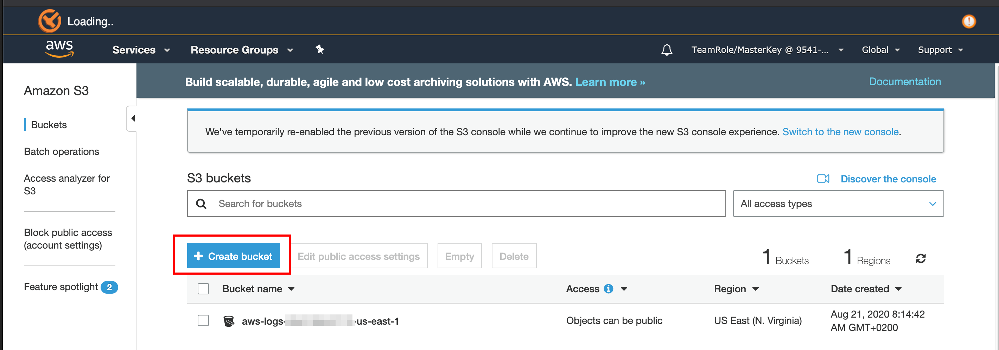
  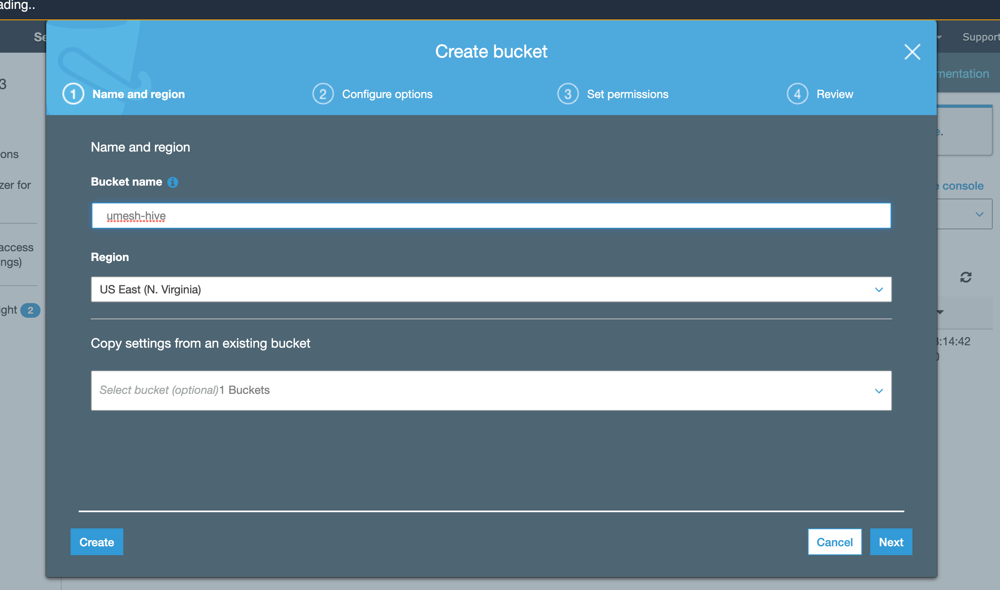
  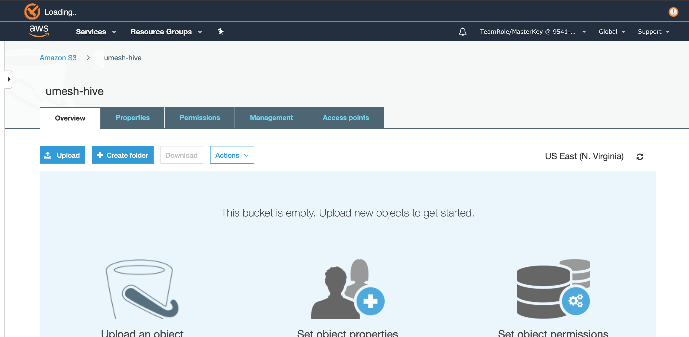
  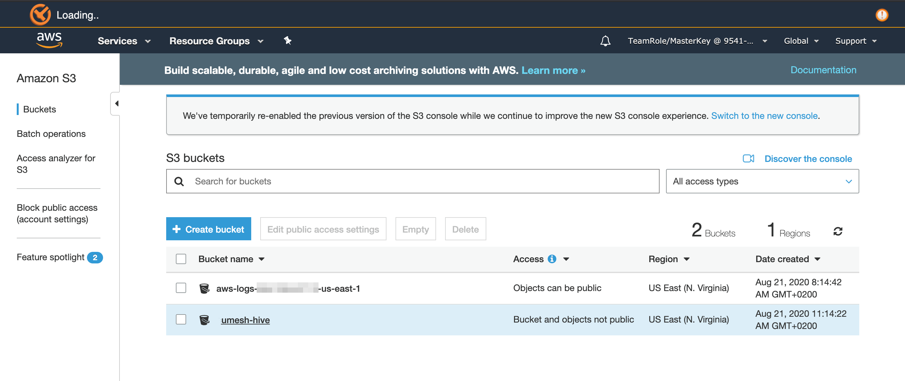

2. Create a cluster as shown in the procedure called To create a cluster with Tez installed using the console. Choose Hive as an application in addition to Tez.
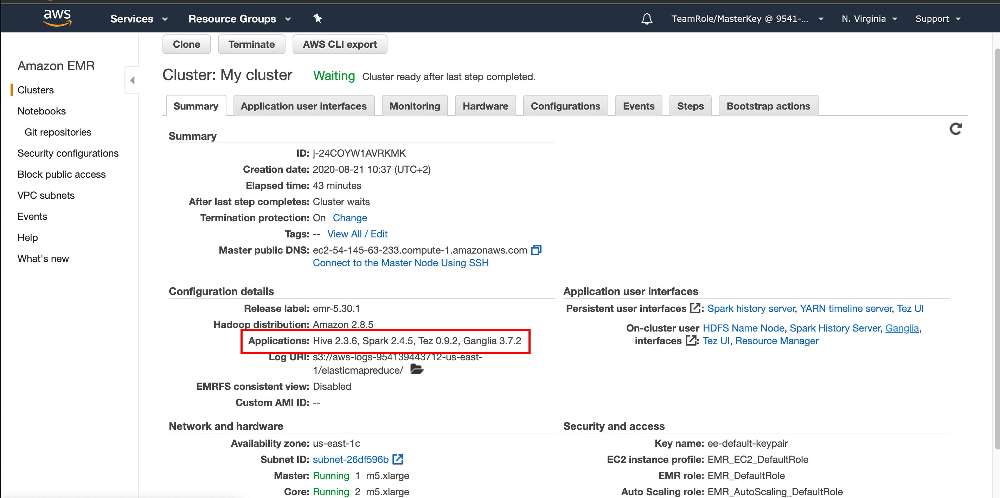

3. Connect to the cluster master node using SSH. For more information, see Connect to the Master Node Using SSH.
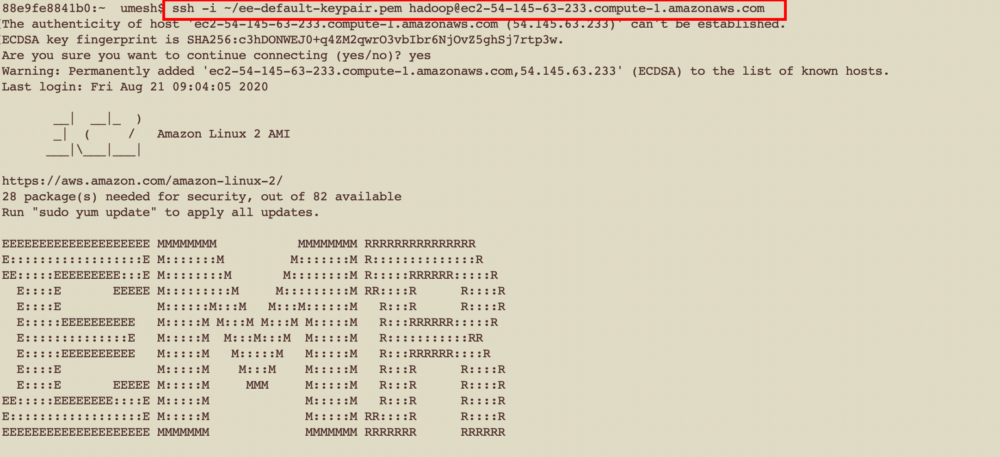

4. Run the `Hive_CloudFront.q` script using MapReduce with the following command, where region is the region in which your cluster is located:
  > <pre>hive -f s3://eu-west-1.elasticmapreduce.samples/cloudfront/code/Hive_CloudFront.q \ -d INPUT=s3://eu-west-1.elasticmapreduce.samples \ -d OUTPUT=s3://<code style="color:red;"/>umesh-hive</code>/mr-test/ <i>-hiveconf hive.execution.engine=mr</i></pre>
  > <small> * change the highlighted to your name and append "-hive" e.g. umesh-hive</small>

  > The output should look something like the following:  
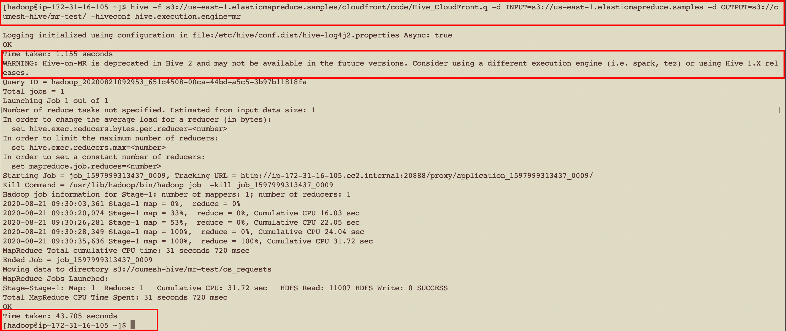
<small>* Take note of the time taken to run the query 43.705 seconds when using the deprecated MapReduce engine </small>

5. Now run the job with the Tez execution engine using the following command:
  > <pre>hive -f s3://eu-west-1.elasticmapreduce.samples/cloudfront/code/Hive_CloudFront.q \ -d INPUT=s3://eu-west-1.elasticmapreduce.samples \ -d OUTPUT=s3://<code style="color:red;"/>umesh-hive</code>/tez-test/ <i>-hiveconf hive.execution.engine=tez</i></pre>
  > <small> * change the highlighted to your name and append "-hive" e.g. umesh-hive</small>

  > The output should look something like the following:
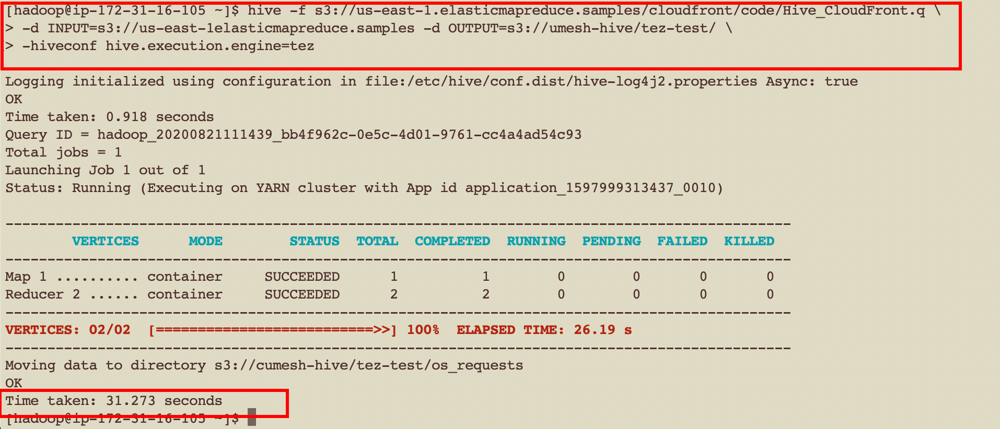
<small> * Take note of the time taken to run the query 31.273 seconds when using the recommended Tez engine, ~30% faster than MR </small>

# [Tez Web UI](https://docs.aws.amazon.com/emr/latest/ReleaseGuide/tez-web-ui.html)

Tez has its own web user interface. To view the web UI, see:
  > <code>http://<code style="color:red;">masterDNS</code>:8080/tez-ui</code> <small> * change the highlighted to the master DNS name of your EMR cluster which you get from the <a href="https://eu-west-1.console.aws.amazon.com/elasticmapreduce/home?region=eu-west-1#cluster-list:">EMR Console</a>
  >  </img>

* Here's an output to see all Tez queries
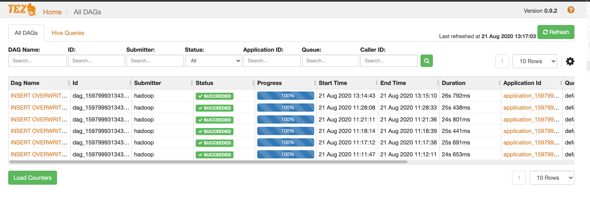

* Here's output to view details of a single query
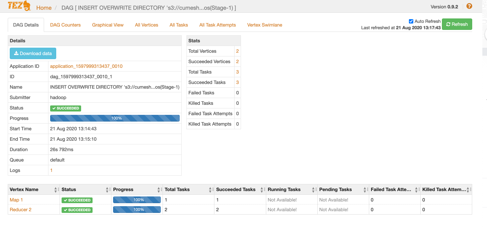

# [YARN Timeline Server](https://docs.aws.amazon.com/emr/latest/ReleaseGuide/tez-timeline-server.html)

The YARN Timeline Service is configured to run when Tez is installed. To view jobs submitted through Tez or MapReduce execution engines using the timeline service, view the web UI using the URL <code>http://<code style="color:red;">master-public-DNS</code>:8188</code>. For more information, see [View Web Interfaces Hosted on Amazon EMR Clusters](https://docs.aws.amazon.com/emr/latest/ManagementGuide/emr-web-interfaces.html) in the Amazon EMR Management Guide.

  * Screenshot of a view of all YARN applications.
  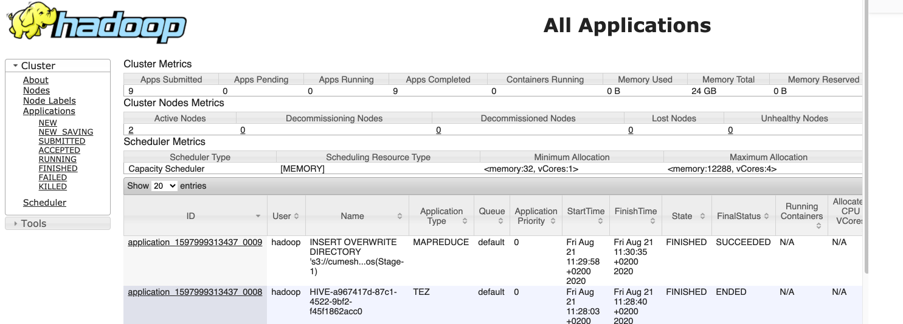  
    * Here we can see both the MapReduce and Tez queries we ran earlier

  * Screenshot of YARN details of a single application
    

     <ul><li>Here we can see the node in the cluster which the job ran on. </li><li>We can also get access to logs of the application. * Which are very important when troubleshooting issues regarding a job </li></ul>
